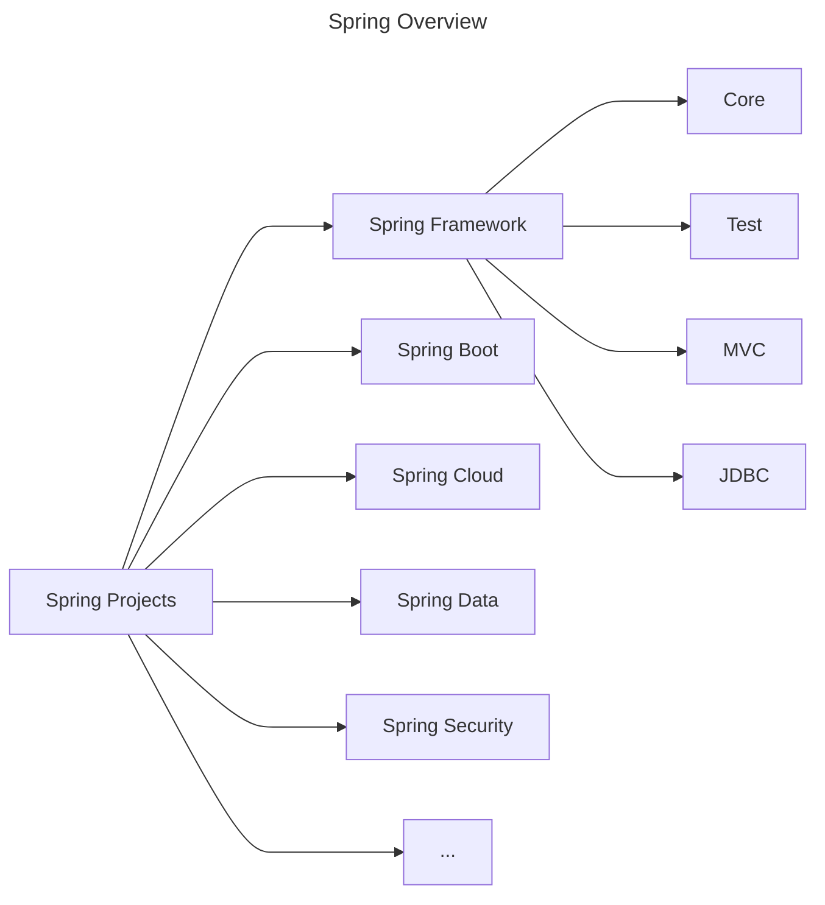

# 1. Lazy and Eager Initialization
By default the intialization of Spring Beans is **eager**. To make a bean lazily initializaed add the `@Lazy` annotation.
```java
@Component
@Lazy
class ClassA {
    public ClassA() {
        System.out.println("ClassA being created...");
    }
}
```

> [!note]
> Eager initialization is recommended because errors in the configuration are discovered immediately at application startup.

- `@Lazy` annotation
	- Can be used anywhere `@Component` and `@Bean` are used.
	- Lazy-resolution proxy will be injected instead of actual dependency.
	- Can be used on configuration (`@Configuration`) class.
		- All `@Bean` methods within the `@Configuration` will be lazily initialized.

# 2. Comparing Lazy Initialization vs Eager Initialization
| Heading                                           | Lazy                                                              | Eager                                             |
| ------------------------------------------------- | ----------------------------------------------------------------- | ------------------------------------------------- |
| Initialization Time                               | Bean initialized when it is first made use of in the application. | Bean initialized at the startup of application.   |
| What happend if there are errors in initializing? | Errors will result in runtime exception.                          | Errors will prevent application from starting up. |
| Memory Consumption                                | Less (until bean is initialized)                                  | More (All beans are initialized at startup)       |
| Recommended Scenario                              | For beans that are rarely used in your app.                       | Most of your beans                                |

# 3. Exploring Java Spring Framework Bean Scopes - Prototype and Singleton
Singleton: One object instance per Spring IOC container.
Prototype: Possibly many object instances per Spring IOC container.
The default bean scope is **Singleton**. To specify a scope add the `@Scope(value = <scope-type>)` annotation.
```java
@Component
class Singelton {}

@Component
@Scope(value = ConfigurableBeanFactory.SCOPE_PROTOTYPE)
class Prototype {}
```

There are other scopes which are available only for web-aware Spring ApplicationContext
- Request: One object instance per single HTTP request.
- Session: One object instance per user HTTP session.
- Application: One object instance per web application runtime.
- Websocket: One object instance per WebSocket instance.


Java singleton is different from spring singleton. Spring singleton means one object instance per *Spring IOC container* while Java singleton means one object instance per *JVM*. 

Singleton bean scope is recommended for **stateless** beans while prototype bean scope is recommended for **stateful** beans.

# 5. Exploring Spring Beans - `PostConstruct` and `PreDestroy`
Method annotated with `@PostConstruct` is executed just after all the dependencies have been injected.
> *Why use `@PostContruct` if you can use that method directly from constructor?*
> Because at the time of constructor call, not all the dependencies are injected (except for the constructor based dependencies). Thus if you try to use any dependency inside constructor, that might result in a `NullPointerException`.


Method annotated with `@PreDestroy` is executed just before the bean is removed from ApplicationContext.
```java
@Component
class Server {
    private DatabaseOperator databaseOperator;
    @Autowired
    private HtmlWriter htmlWriter;

    public Server(DatabaseOperator databaseOperator) {
        this.databaseOperator = databaseOperator;
    }

    @PostConstruct
    public void initializePage() {
        String data = databaseOperator.fetchData();
        htmlWriter.writeData(data);
    }

    @PreDestroy
    public void cleanup() {
        databaseOperator.closeDbConnection();
    }
}

@Component
class DatabaseOperator {
    public String fetchData() {
        return "data";
    }

    public void closeDbConnection() {
        System.out.println("closing connection to the database...");
    }
}

@Component
class HtmlWriter {
    public void writeData(String data) {
        String html = "<p>" + data + "</p>";
        System.out.println(html);
    }
}
```

# 6. Evolution of Jakarta EE
Enterprise capabilities were initially build into the JDK.
With time, they were separated out:
1. J2EE - Java 2 Platform Enterprise Edition
2. Java EE - Java Platform Enterprise Edition
3. Jakarta EE - (Oracle gave Java EE rights to the Eclipse Foundation)

Jakarta EE has some important specifications like:
- Jakarta Server Pages (JSP)
- Jakarta Standard Tag Library (JSTL)
- Jakarta Enterprise Beans (EJB)
- and many more

Spring 6 and Spring Boot 3 supports Jakarta EE.

# 7. Jakarta Contexts & Dependency Injection (CDI)
Spring Framework V1 was released in 2004.

CDI specification introduced into Java EE 6 platform in December 2009. Now called Jakarta Contexts and Dependency Injection (CDI)
CDI is a specification (interface). Spring Framework implements CDI.

Important Inject API Annotations:
- Inject (Autowired in Spring)
- Named (Component in Spring)
- Qualifier
- Scope
- Singleton

# 8. Java Spring XML Configuration
At the start of the Spring XML was used for defining configurations. Nowadays it is rarely use.

## Step 1. Create a XML configuration file
Create a configuration file under the `resources` folder.

```xml
<?xml version="1.0" encoding="UTF-8"?>
<beans xmlns="http://www.springframework.org/schema/beans"
       xmlns:xsi="http://www.w3.org/2001/XMLSchema-instance"
       xmlns:context="http://www.springframework.org/schema/context" xsi:schemaLocation="
        http://www.springframework.org/schema/beans http://www.springframework.org/schema/beans/spring-beans.xsd
        http://www.springframework.org/schema/context http://www.springframework.org/schema/context/spring-context.xsd"> <!-- bean definitions here -->
    <bean id="name" class="java.lang.String">
        <constructor-arg value="Steve Rogers"/>
    </bean>

<!--    <context:component-scan base-package="com.azmalakhtar.learn_spring_framework.game" />-->

    <bean id="game" class="com.azmalakhtar.learn_spring_framework.game.SuperContraGame"/>
    <bean id="gameRunner" class="com.azmalakhtar.learn_spring_framework.game.GameRunner">
        <constructor-arg ref="game"/>
    </bean>

</beans>
```

## Step 2. Use it in the Java Code
Instead of using `AnnotationConfigApplicationContext`, use `ClassPathXmlApplicationContext` to create a context object.
```java
public class XmlConfigLauncher {
    public static void main(String[] args) {
        try (var context = new ClassPathXmlApplicationContext("context-config.xml")) {
            Arrays.stream(context.getBeanDefinitionNames())
                    .forEach(System.out::println);
            context.getBean(GameRunner.class).run();
        }
    }
}
```

# 9. Java Annotations vs XML Configuration
| Heading              | Annotations                                                         | XML Configuration            |
| -------------------- | ------------------------------------------------------------------- | ---------------------------- |
| Ease of use          | Very Easy (defined close to source - class, method and/or variable) | Cumbersome                   |
| Short and Concise    | Yes                                                                 | No                           |
| Clean POJOs          | No. POJOs are polluted with Spring Annotations                      | Yes. No change in Java Code. |
| Easy to Maintain     | Yes                                                                 | No                           |
| Usage Frequency      | Almost all recent projects                                          | Rarely                       |
| Recommendation       | Either of them is fine. **But be consistent**.                      | **Do not mix both**.         |
| Debugging Difficulty | Hard                                                                | Medium                       |
|                      |                                                                     |                              |

# 10. Stereotype Annotations
`@Component`: Generic annotation applicable for any class. It is base for all Spring Stereotype Annotations.
There are other specific annotations based on the `@Component`.
`@Service`: Indicates that an annotated class has business logic.
`@Controller`: Indicates than an annotated class is a "Controller" (e.g. a web controller)
`@Repository`: Indicates than an annotated class is used to retrieve and/or manipulate data in a database.

> [!note]
> Use the most specific annotation possible. WHY?
> - By using a specific annotation, you are giving more information to the framework about your intentions.
> - You can use AOP at a later point to add additional behaviour.


# 13. Spring Big Picture

Spring Projects > Spring Framework > Spring Modules

## Why is Spring Eco system popular?
- **Loose Coupling**: Spring manages creation and wiring of beans and dependencies.
- **Reduced Boilerplate Code**: Focus on Business Logic.
- **Architectural Flexibility**: Spring Modules and projects. You don't need to use all of them, you could pick and choose.
- **Evolution with Time**: Microservices and Cloud


---
### References
- [Master Spring Boot 3 & Spring Framework 6 with Java](Master%20Spring%20Boot%203%20&%20Spring%20Framework%206%20with%20Java.md)