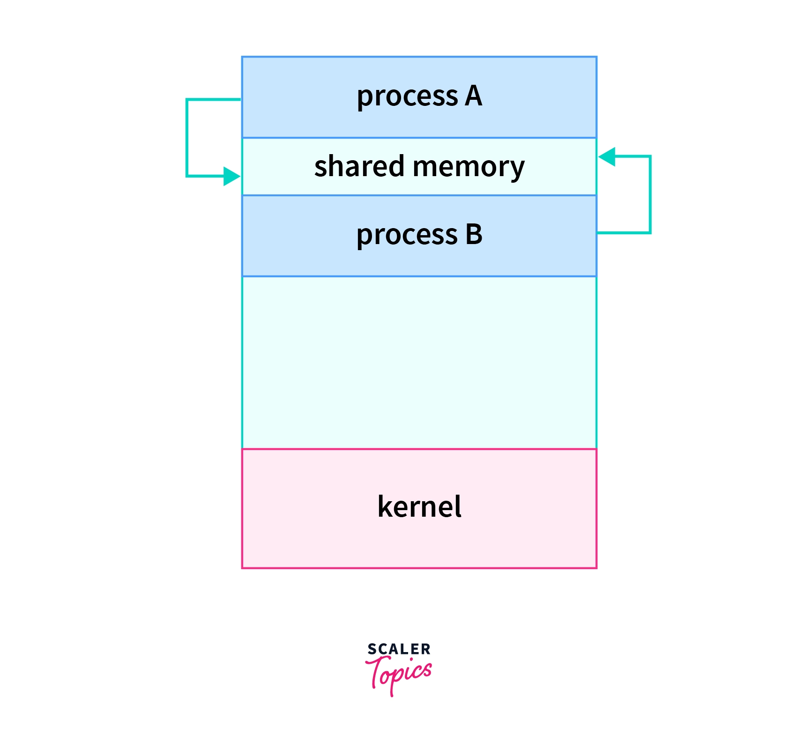
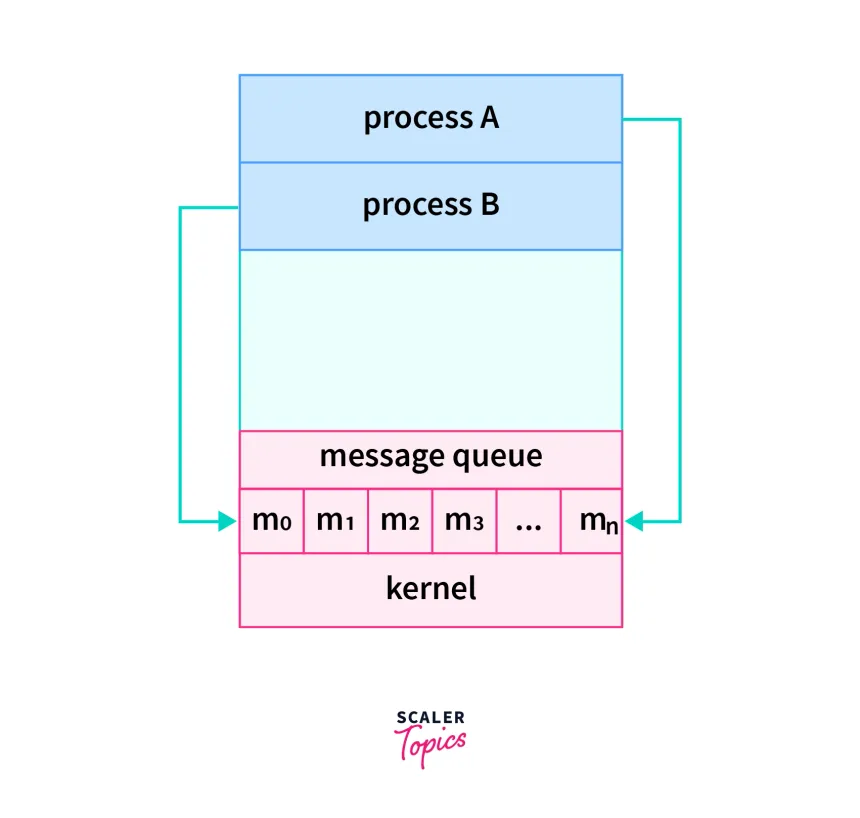
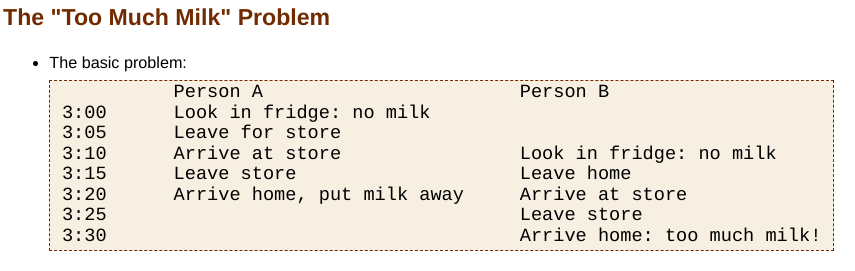

- Processes executing concurrently in the operating system may be either independent processes or cooperating processes.
- A process is independent if it cannot affect or be affected by the other processes executing in the system. Any process that does not share data with any other process is independent.
- A process is cooperating if it can affect or be affected by the other processes executing in the system. Clearly, any process that shares data with any other process is cooperating.
## Inter Process Communication
- Only cooperating processes do IPC.
- Two cooperating process on the same computer, requires only OS to do IPC.
- Two cooperating process on the different computers, requires OS as well as computer networks to do IPC.
- OS provides facilities for Inter- Process Communication
	- Shared Memory
	- Message Passing
	- Pipes
### Shared Memory

- In the shared-memory model, a region of memory that is shared by cooperating processes is established.
- Processes can then exchange information by reading and writing data to the shared region.
- Shared memory is created in the user space.
- Easiest way for processes to communicate.
	- at least some part of each processes memory region overlaps the other process
- If A want to communicate to B
	- A writes into shared region
	- B read from shared region
	- & vice-versa
- To create shared memory, we need OS support(system call), but once it is created then we don't require OS support because shared memory is in user space.
- We use `shmget()` & `shmat()` system calls for shared memory.
- Where is this shared memory located?
	- It is in the physical memory(RAM) but it is neither present in the stack nor in the heap of a process. So, it is created separately.

### Message Passing

- Message passing is useful for exchanging smaller amounts of data, because no conflicts need be avoided. It is also easier to implement in a distributed system than shared memory.
- It provides a mechanism to allow processes to communicate and to synchronize their actions without sharing the same address space.
- A message-passing facility provides at least two operations: `sent(message)` & `receive(message)`.
- Message sent by a process can be either fixed or variable in size.
- The shared region is created in the kernel space.
- OS intervention is required everytime in case message passing.
#### Shared Memory vs Message Passing
- SM can be faster than MP since MP system are typically implemented using system calls and thus require more time-consuming task of kernel intervention.
- In SM systems, system calls are required only to establish SM regions. Once shared memory is established, all accesses are treated as routine memory accesses, and no assistance from the kernel is required.
### Pipes

- A pipe is a link between two processes. One process writes into one end of the pipe & another process reads out of the other end.
- Messages are read in the order they are written.
- For both processes to be able to read and write simultaneously, two pipes are necessary.

## Need of Synchronization

- Without synchronization, the processes leads to inconsistencies.
### Race Condition
- Let's say we have two different processes, named producer(P) & consumer(C).
- P : `counter--`
- C: `counter++`
- Let initial x = 0
- Machine Language Code for P
	- reg1 = count
	- reg1 = reg1 - 1
	- count = reg1
- Machine Language Code for C
	- reg2 = count
	- reg2 = reg2 + 1
	- count = reg2
- If the processes are executed sequentially, then the result will be 5.
- If these processes are executed concurrently, then one of the possible order of execution is 
T0: producer execute r1 = count  {r1 = 5}
T1: producer execute r1 = r1 + 1 {r1 = 6}
T2: consumer execute r2= count {r2 = 5}
T3: consumer execute r2= r2 - 1 {r2 = 4}
T4: producer execute count = r1 {count = 6}
T5: consumer execute count = r2 {count = 4}

- This leads to incorrect answer 4. If we executed T5 before T4, then the answer will be 6.
> [!Note]
> A situation where several processes access and manipulate the same data concurrently and the outcome of the execution depends on the particular order in which the access takes place is called a **race condition**.

