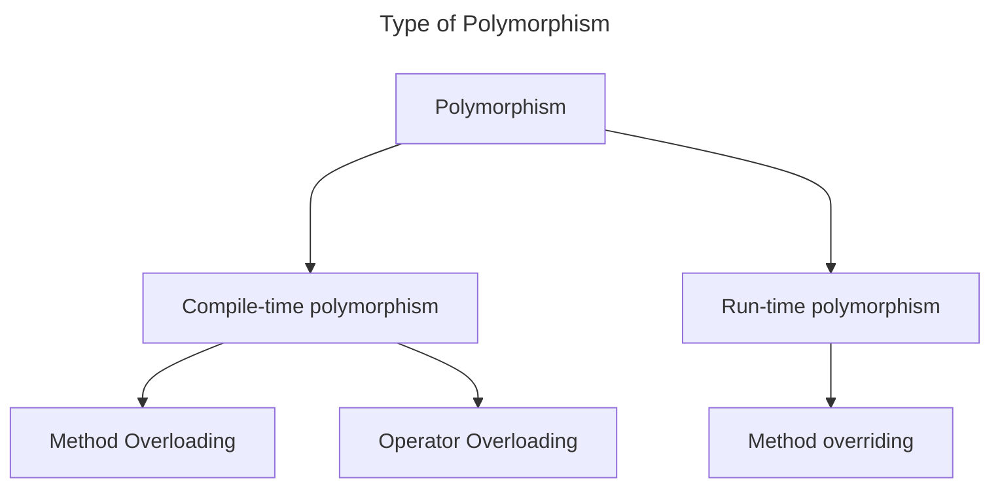
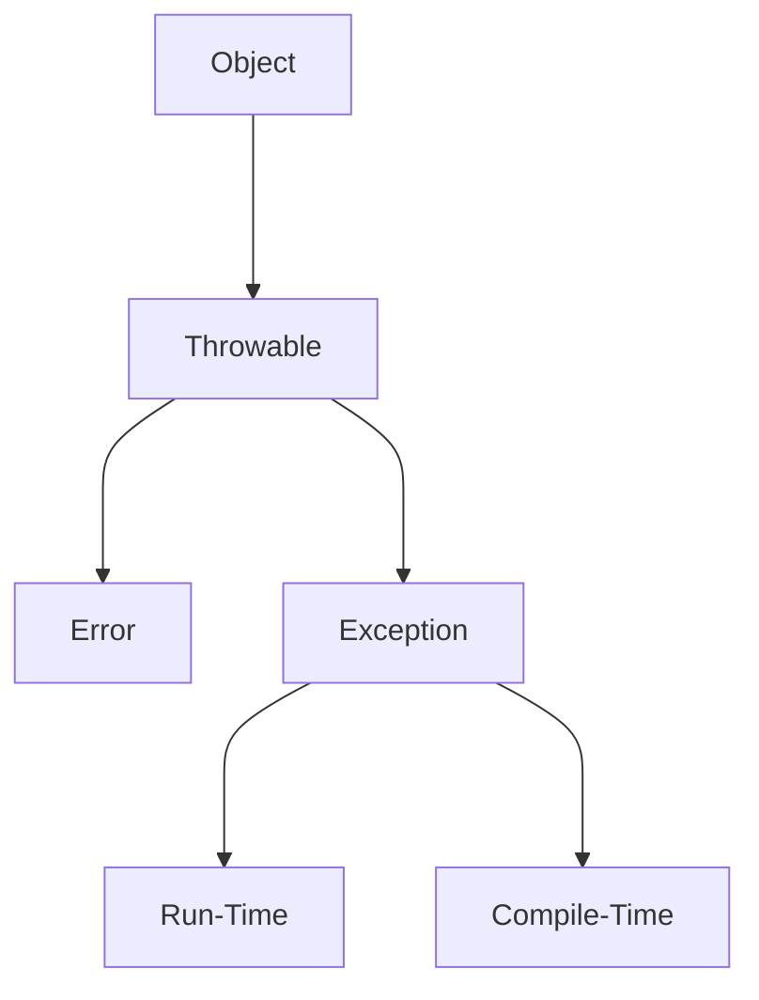
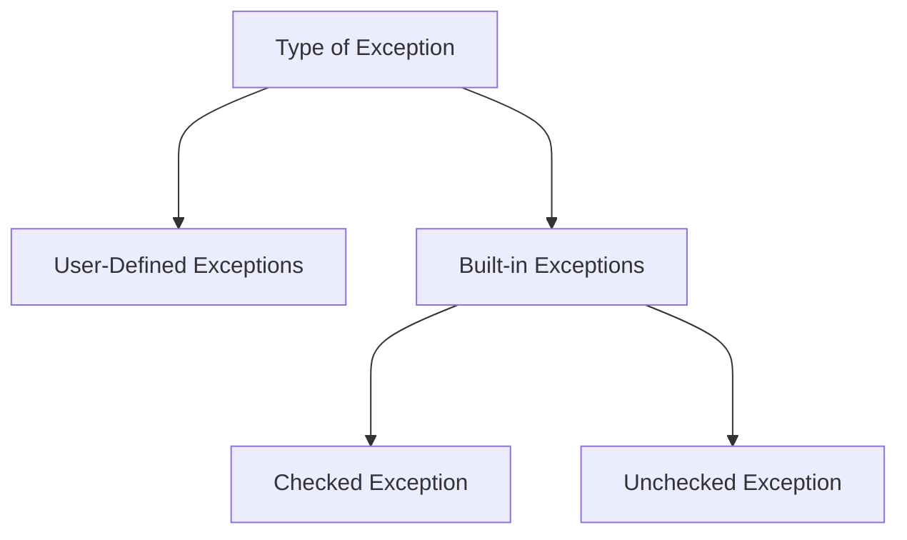
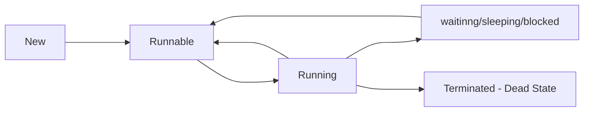

## 6. Classes & Objects
### 1 Procedural vs Object Oriented Programming
In procedural programming, we design the system around the procedures that happens. While in object oriented programming, we design the system around actors (object) which interact with each other.

For example if we have to create a bank application. In procedural programming, we will create function to withdraw, deposit and transfer. In object oriented programming, we will create a customer, money, and account object which will interact with each other.

### 3. Declaring objects
`new` keyword allocated the memory at runtime (**dynamic allocation**).

### 6. Constructors & Code Blocks
A `static` block is called only once when the class is first loaded while a normal block is called everytime an object is created. These blocks are executed before constructor calls.

### 8. Primitive vs Reference Types
| Primitive                              | Reference                        |
| -------------------------------------- | -------------------------------- |
| Store actual values                    | Store addresses to objects       |
| Have specific defaults like 0 or false | Have `null` as default value     |
| Stored in stack.                       | Stored on heap.                  |
| They are compared by value.            | They are compared by references. |

### 10. Garbage Collection & Finalize
**Generational Collection**. Java uses a generational garbage collection strategy which divides the memory into different regions (young, old, and permanent generations) based on object ages.


## 8. Encapsulation & Inheritance
### 3. Packages & Imports
You can create packages and import them. They allow you to avoid class name collision by providing namespace.

### 4. Access Modifiers
| Modifier    | Allow                                                       |
| ----------- | ----------------------------------------------------------- |
| `private`   | Can be accessed in the defining class only.                 |
| `default`   | (if no modifier is specified) only within the same package. |
| `protected` | only within the same package and subclasses.                |
| `public`    | from any other class.                                       |
A class can only be `default` or `public`. Member variables (constructor, variables, and methods) can have any of the four modifiers.
Start with the most restrictive modifier and only change it if needed.

### 5. Getter and Setter
They allow you much more control than just the access modifier as you can:
1. Specify different modifier for writing and reading of the data.
2. You can validate the writing of the data.
3. Allows for changing the internals without affecting the external interfaces.

### 7. Types of Inheritance
Java doesn't support multiple inheritance(a child can't inherit from more than one parent).

### 8. Object Class
 A class in Java source code which doesn't explicitly inherit from any class, inherits from the `Object` class. Thus `Object` class is the parent of every class.

### 9. Equals and Hash Code
`==` checks the referential equality. To define custom equal, override the `Objects`'s `equals` method.
```java
    @Override
    public boolean equals(Object obj) {
        if (!(obj instanceof Citizen)) return false;
        Citizen other = (Citizen) obj;
        return (this.aadharNumber == other.aadharNumber && this.name.equals(other.name) && this.age == other.age);
    }
```

**Equal-Hashcode contract**. If two objects are equal according to `equals`, they must have the same hash code. However, two objects with the same hash code aren't necessarily equal. Thus if `equals` is overriden, `hashCode` should also be overriden to maintain consistency between these methods.

### 10. Nested and Inner Class
Nested class can be either static or non-static. Non-static nested classes are called inner class.

## 9. Abstraction and Polymorphism
### 2. Abstract Keyword
You could mark a class or a method in an abstract class as `abstract`.

### 3. Interfaces
You could define an interface using the `interface` keyword.
A class could implement from multiple interfaces. 
An interface could extend another interface.

### 4. Polymorphism


### 5. References and Objects
**Upcasting**. Converts subclass to superclass reference. It is automatic and safe. The new reference only has access to superclass methods.
**Downcasting**. Converts superclass to subclass reference. It is manual and risky. The new reference has access to subclass methods.

### 6. Method / Constructor Overloading
Multiple methods in the same class having the same name but different parameter list.
Overloaded methods must differ in the type, number, or sequence of their parameters.
Overloaded methods can have different return types, but that alone doesn't distinguish them.
### 8. Method / Constructor Overriding
A subclass could override any method defined in the superclass.
When you call a overriden method on a parent reference which is referencing a child object, the child's implementation will be called. In short which implementation is called will depend upon the type of object rather than on the type of reference.

The access level cannot be more restrictive than the overriden method's access level.
`@override` annotation is optional but helpful as it makes sure that the method is properly overriden.

### 9. `final` keyword
Final variable => creates constant variables
Final methods => prevents method overriding
Final class => prevent inheritance

### 10. Pass by value and reference
In Java, primitives are passed by value while object and references are passed by references.

## 10. Exception and File Handling
### 1. What is an Exception?
Exception is a disruptive event that occurs during the execution of a program, interrupting its normal flow. In Java, Exceptions are objects that contain information about an error event, including its type and the state of the program when the error occurred.



Errors are events that are not caused by the program logic but rather the system is somehow compromised.

### 2. Try-Catch
```java
try {
    int result = firstNum / secondNum;
    System.out.printf("The result is %d.\n", result);
} catch (ArithmeticException exception) {
    System.out.printf("%s, enter valid values", exception.getMessage());
}
```

### 3. Types of Exception


Checked exceptions must either be caught or declared. 

### 4. Throw and Throws
```java
  public static void printName(String name) throws IllegalArgumentException {
    if (name.contains("-")) {
      throw new IllegalArgumentException("Name contains -");
    }
    System.out.println(name);
  }

```

Checked exceptions can not be propagated using `throw`, they are propagated using `throws`.

### 5. finally Block
Executes after the try-catch blocks. It runs regardless of whether an exception is thrown or caught in the try-catch blocks.
It is mostly used for cleaning resources.

### 6. Custom Exceptions
It is recommended to extend `RuntimeException` for custom exceptions instead of extending `Exception` class.

### 7. `FileWriter` Class
It is used writing streams of character to a file.
```java
  public static void main(String[] args) {
    String fileName = "example.txt";

/* 
for this type of try variable declaration, Java automatically cleans up the resource 
*/
    try (FileWriter writer = new FileWriter(fileName)) { 
      writer.write("Hello, this is a test.\nFrom Java Program");
      writer.flush();
      System.out.println("Successfully written.");
      writer.close();
    } catch (IOException exception) {
      System.out.println("Error in writing file");
      exception.printStackTrace();
    }
  }
```

### 8. `FileReader` class
It is used to read streams of data.
```java
  public static void main(String[] args) {
    String fileName = "example.txt";

    try (FileReader reader = new FileReader(fileName)) {
      int character;
      while ((character = reader.read()) != -1) {
        System.out.print((char) character);
      }
    } catch (IOException exception) {
      System.out.println("Error in reading file");
      exception.printStackTrace();
    }
  }

```

## 11. Collections & Generics
### 1. Variable Arguments
```java
  static int sum(int... numbers) {
    int total = 0;
    for (int number : numbers) {
      total += number;
    }
    return total;
  }
```

### 3. Wrapper Classes & Autoboxing
Java provides a wrapper class for all the primitive types.
**Autoboxing** is the automatic conversion of a primitive type to their corresponding wrapper class objects.
**Unboxing** is the automatic conversion of wrapper class objects back to their respective primitive types.

### 4. Collections Library
#todo/add collections hierarchy
> [!warning]
> Generics exist only on the compile time, in run time there is no generics.

### 7. Collections Class
It is a utility class which provides some common functions that are used on collections.

### 10. Generics & Diamond Operators
Generics provides compile-time type safety by allowing you to enforce that certain objects are of a specific type.
```java
class Box<T> {
  private T thing;

  Box(T thing) {
    this.thing = thing;
  }

  public T getThing() {
    return thing;
  }

  public void setThing(T thing) {
    this.thing = thing;
  }
}

```


## 12. Multithreading & Executor Sservice
### 1. Intro to Multithreading
##### When to use Multithreading?
1. Tasks might be time constrained.
2. Tasks are independent of each other.
3. A multi-core CPU is sitting idle most of the time.
4. A big task can be divided into smaller parts.
5. Making your code responsive.

### 2. Creating a Thread
#### By extending the `Thread` class
```java
class PrintTask extends Thread {
  private final char modChar;

  PrintTask(char modChar) {
    this.modChar = modChar;
  }

  @Override
  public void run() {
    for (int i = 1; i <= 1000; i++) {
      System.out.printf("%d%c ", i, modChar);
    }
  }
}
```
To specify the task that need to be run on a new Thread, override the `run` method and put the task inside it.
To start the new thread, call the `start` method on the object of the class extending thread.
```java
  public static void main(String[] args) {
    PrintTask pt1 = new PrintTask('*');
    PrintTask pt2 = new PrintTask('$');
    PrintTask pt3 = new PrintTask('#');
    pt1.start();
    pt2.start();
    pt3.start();
  }

```

#### By implementing the `Runnable` interface
```java
class PrintTask implements Runnable {
  private final char modChar;

  PrintTask(char modChar) {
    this.modChar = modChar;
  }

  @Override
  public void run() {
    for (int i = 1; i <= 1000; i++) {
      System.out.printf("%d%c ", i, modChar);
    }
  }
}
```
You can't directly start a task on new Thread by just using the `Runnable` interface.
Instead you need to pass the `Runnable` as a constructor parameter to the `Thread` class and then use that `Thread` class to do that task on new thread.
```java
  public static void main(String[] args) {
    long startTime = System.currentTimeMillis();

    PrintTask pt1 = new PrintTask('*');
    PrintTask pt2 = new PrintTask('$');
    PrintTask pt3 = new PrintTask('#');
    Thread t1 = new Thread(pt1);
    Thread t2 = new Thread(pt2);
    Thread t3 = new Thread(pt3);
    t1.start();
    t2.start();
    t3.start();

    long endTime = System.currentTimeMillis();
    System.out.printf("\n\nTotal Time Taken: %d", (endTime - startTime));
  }
```

### 3. States of a Thread

- **New**: Thread is created but not started.
- **Runnable**: Thread is ready for running.
- **Running**: Thread is actively executing tasks.
- **Blocked/Waiting/Blocking**: Thread is alive but not active because it's waiting for other resources or threads.
- **Terminated**: Thread is finished or stopped running.

### 4. Thread Priority
Java threads have a priority levels from 1(lowest) to 10(highest).
> [!warning]
A thread's priority suggests the importance of a thread to the scheduler though it doesn't guarantee the order of the execution.

You can set and get the priority of a Thread using the setter & getter defined by `Thread` class.

### 5. Join Method
The `join` method is used to make the calling thread wait until the thread on which join has been called completes its execution.
It is used for synchronization of the threads.

### 6. Synchronize Keyword
```java
class CounterThread extends Thread {
  private Counter counter;

  CounterThread(Counter counter) {
    this.counter = counter;
  }

  @Override
  public void run() {
    for (int i = 1; i <= 1000; i++)
      counter.increment();
  }
}

class Counter {
  private int count = 0;

	/*
	using the synchronized keyword makes sure that only one thread is executing this method, thus providing mutual exclusion
	*/
  synchronized void increment() {
    count++;
  }

  void displayCount() {
    System.out.printf("Count is %d", count);
  }
}

```

```java
  public static void main(String[] args) throws InterruptedException {
    Counter counter = new Counter();
    CounterThread t1 = new CounterThread(counter);
    CounterThread t2 = new CounterThread(counter);
    t1.start();
    t2.start();
    t1.join();
    t2.join();
    counter.displayCount();
  }
```

If we don't use the `synchronize` keyword on the `increment` method of `Counter` class, the output isn't always 2000, sometimes it is less than 2000 because of the race condition.

### 7. Thread Communication
Thread class have some methods which can change the state of the thread itself.


---
### References
- [Java Complete Basics to Advanced](https://www.youtube.com/playlist?list=PL78RhpUUKSweClRi_l05UgfE3053-zkRf)