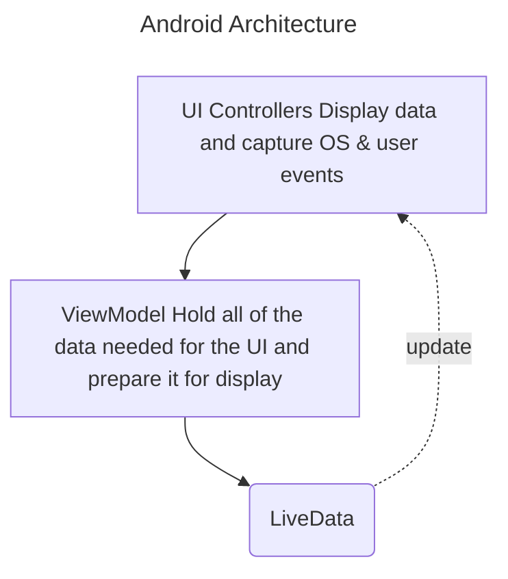

domain: 
course: [[Android Development Kotlin Course Udacity]]
teacher:
date: 2024-04-27
time: 08:16
status: #unprocessed

# App Architecture (UI Layer)


## 1. Architecting on The Fly
## 2. Lesson Introduction
> [!Note]
> In this lesson
> - Application Architecture
> - ViewModel
> - LiveData
> - Data Binding
## 3. Tour Of The App
## 4. Where the App Falls Short
## 5. What is Architecture
> The design of an application's classes and relationships between them.
## 6. Our App Architecture
- Separation Of Concerns - Divide your code into classes, each with separate, well-defined responsibilities.

## 7. ViewModel
- Abstract class that holds your app's UI data and survives configuration changes.
## 8. Exercise: Create the `GameViewModel`
- We don't directly create viewmodels instead we get a viewmodel from `ViewModelProvider`.
## 9. What Belongs in the `GameViewModel`?
- UI controller only displays and gets user/OS events.
- ViewModel holds data for UI.
- UI controller does not make decisions.
- ViewModel never references fragments, activities or views.
## 10. Exercise: Populate the `GameViewModel`
## 11. The Benefits of a Good Architecture
- Organized
- Easier to debug
- Fewer Lifecycle issues
- Modular - can swap out a class with different implementation
- Testable - no need to emulate Android Framework
## 12. The Power and Limits of the ViewModel
- Viewmodel do survive configuration changes but it doesn't survive OS shutdown.
## 13. LiveData
> An observable data holder class that is also lifecycle-aware.
## 14. Exercise: Add LiveData to GameViewModel
## 15. Lifecycle Awareness
- Aware of UI controller lifecycle state
- Ui controller off-screen , no updates
- UI controller back on-screen, get current data
- New UI controller observes, get current data
- UI controller destroyed, it cleans up connection
## 16. Exercise: Add LiveData Encapsulation to GameViewModel
## 17. Event vs State
- LiveData is made for tracking state. But we can use it to capture events also.
## 18. Exercise: Add End Game Event
## 19. Google Interview: Yigit Boyar
## 20. Adding a Timer
## 21. Exercise: Add CountDownTimer
## 22. Exercise: Add a ViewModelFactory
- You can pass value to ViewModel either using a setter or as a constructor parameter.
- If you want the parameter to be available at the time of creation, then pass it as constructor parameter.
	- Create a ViewModel that takes in a constructor parameter
	- Make a ViewModel Factory for ViewModel
	- Have factory construcy ViewModel with constructor parameter
	- Add ViewModel Factory when using ViewModelProviders
```kt
// ViewModelFactory
class ScoreViewModelFactory(private val finalScore: Int) : ViewModelProvider.Factory {
    override fun <T : ViewModel?> create(modelClass: Class<T>): T {
       if (modelClass.isAssignableFrom(ScoreViewModel::class.java)) {
           return ScoreViewModel(finalScore) as T
       }
        throw IllegalArgumentException("Unknown ViewModel Class")
    }
}

// In Fragment
viewModelFactory = ScoreViewModelFactory(scoreFragmentArgs.score)
viewModel = ViewModelProvider(this, viewModelFactory).get(ScoreViewModel::class.java)
```
	
	
## 23. Exercise: Add ViewModel to Data Binding
- Right now UI controller acts as a middle man between viewModel(data) & layout(view). We can eliminate the need for this using data binding.
### Steps
1. In layout, add a viewmodel variable.
2. Pass the viewmodel varible form fragment to binding. `binding.gameViewModel = viewModel`
3. Invoke and use viewmodel using bindind expressions.
```xml
	// Step 1
    <data>
        <variable
            name="gameViewModel"
            type="com.example.android.guesstheword.screens.game.GameViewModel" />
    </data>
    // Step 3
    android:onClick="@{() -> gameViewModel.onSkip()}"
```
```kt

```
## 24. Exercise: Add LiveData Data Binding
- We can bind LiveData directly to views and the views will update automatically.
## 25. Exercise: LiveData Map Transformation
- `Transformations.map()` is a function that takes one LiveData as input and converts it into another LiveData.
- If LiveData A is updated, it will automatically update the LiveData B.
## 26. Optional Exercise: Adding the Buzzer
## 27. Recap of Architecture and Lifecycles