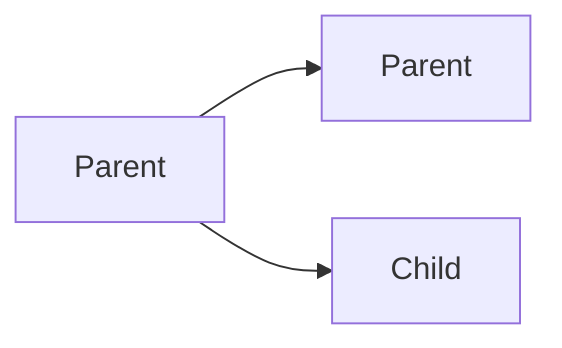

domain: 
course: [[Operating System Mindmatrix]]
teacher:
date: 2024-03-19
time: 09:33
status: #unprocessed

# Lecture 3 fork System Call Continued
- `printf()` prints the logical address not the real physical address.
- Use process graph and fork tree to determine what will be the output of the code.


- How many child processes will create?
```c
for (i = 1; i <= 3; i++) {
	fork();
}
```
- Answer
	- 7

> For n `fork()` calls, there will be total 2^n processes and the number of child processed will be (2^n) - 1.

```c
pid_t pid = fork(); // fork #1
pid = fork();       // fork #2
pid = fork();       // fork #3
if (pid == 0) {
	fork();         // fork #4
}
fork();             // fork #5
```
- How many processes are there?
	- Answer 24
It's fairly easy to reason through this. The `fork` call creates an additional process every time that is's executed. The call returns 0 in the new (child) process and the process id of the child(non zero) in the original (parent) process.
1. Fork #1 creates an additional processes. You now have two processes.
2. Fork #2 is executed by two processed, creating two processed, for a total of four.
3. Fork #3 is executed by four processes, creating four processed, for a total of eight. Half of them have `pid == 0` and half have `pid != 0` 
4. Fork #4 is executed by half of the processes created by fork #3(so, four of them). This creates four additional processed. You now have twelve processes.
5. Fork #5 is executed by all twelve of the remaining processed, creating twelve more processes; you now have twenty-four `24` processes.