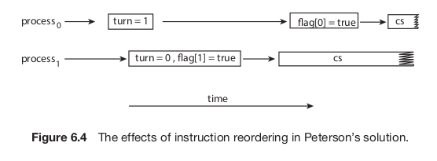

It works for two processes P0 & P1. For convenience, when presenting Pi, we use Pj to denote the other process; that is, j equals 1 - i.
## What is the code?
```cpp
while (true) {
	flag[i] = true;
	turn = j;
	while (flag[j] && turn == j)
	;
	/* critical section */
	flag[i] = false;
	/* remainder section */*
}
```

Shared data items
```cpp
int turn;
boolean flag[2];
```

## What does `flag` & `turn` represent?
`flag` represents whether the process is ready to enter its critical section. `turn` represents whose turn it is to enter the critical section.

## Why software based solutions can not be trusted?
In modern computer architectures, processors and/or compilers may reorder read and write operations that have no dependencies.

### How does this affect Peterson's solution?
Consider what happens if the assignments of the first two statements that appear in the entry section of Peterson's solution are reordered; it is possible that both the threads may be active in their critical sections at the same time (violating mutual exclusion).
