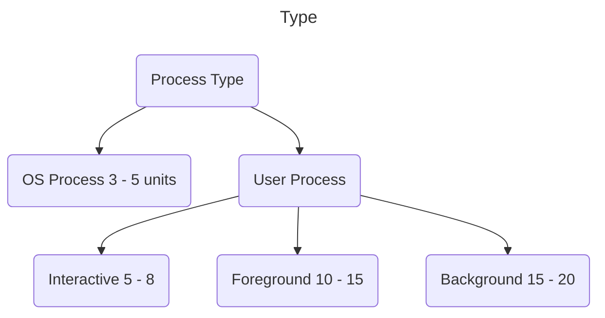

domain: 
course: [[Atlas/Operating System Mindmatrix]]
teacher:
date: 2024-04-29
time: 14:37
status: #unprocessed

# Lecture 10 SJF & SRTF CPU Scheduling Algorithms

### Shortest Job First - SJF
- The cpu is assigned to the process which has the least burst time. If there is a tie in terms of burst time, then FCFS is used to break the tie.
- SJF is optimal - gives minimum average waiting time for a given set of processes.
	- Moving a short process before a long one decreases the waiting time of the short process more than it increases the waiting time of the long process.
	- Consequently, the average waiting time decreases.

### Note
- CPU scheduling algorithms that depends on the burst time are not practically implementable, because burst time can not be known in advance. We use these algorithms as a benchmark to test other algorithms.
- Although we can not known the burst time in advance, we can predict it.
- Practically can't be implemented, but theoretically can be implemented. Min heap can be used, where root element contains the least burst time process.
#### Techniques to Predict Burst Time
##### Static Techniques
###### Based on Process Size
- Burst time of the already executed process of similar size is taken as the burst time for the process to be executed.
- Predicted burst time may not always be right. This is because the burst time of a process also depends on what kind of a process it is.
###### Based on Process Type
- Predicts the burst time for a process based on its type.

##### Dynamic Techniques
###### Simple Averaging
- Given n processes & burst time of each process P(i) is t(i), then predicted burst time for process P(n+1) is
###### Exponential Averaging
- #todo write its notes.
### Shortest Remaining Time First - SRTF
- This is a preemptive version of the SJF. If a new process enters the ready queue & the burst time of this process is less than the remaining burst time of the current process, then this new process gets the CPU.