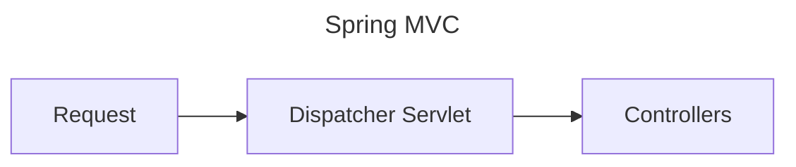
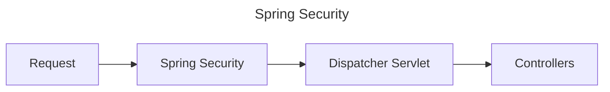

# 0. Overview
1. Security Principles
2. Authentication
3. Authorization
4. Spring Security Fundamentals
5. Spring Security Filter Chain
6. Form Authentication
7. Basic Authentication
8. JWT Authentication
9. CSRF, CORS, ...
10. OAuth

# 1. Understanding Security Fundamentals
In any system, you have resources (rest api, database, etc). An user will make a request to do certain operations on those resources. To secure the resources, we do authentication & authorization.
**Authentication** is determining whether "Is it the right user?". **Authorization** is determining whether "Do they have the right access?".

# 2. Understanding Important Security Principles
> A chains is as strong as its weakest link. Small security flaw makes an app with robust architecture vulnerable.

6 Principles
## Principle 1: Trust Nothing
Validate every request. Validate piece of data or information that comes into the system.

## Principle 2: Assign Least Privileges
Assign minimum possible privileges at all levels (application, infrastructure level etc). Have a clear picture of user roles and accesses. Start the design of the system with security requirements in mind.

## Principle 3: Have Complete Mediation
Apply a well implemented security filter. Test the role and access of each user.

## Principle 4: Have Defense In Depth
Have multiple layers of security - transport, network, infrastructure etc.

## Principle 5: Have Economy Of Mechanism
Security architecture should be simple as simple systems are easier to protect.

## Principle 6: Ensure Openness Of Design
Easier to identify and fix security flaws.

# 3. How Does Spring Security Work?


Dispatcher servlet acts as the front controller. It intercepts all the requests and routes to the right controller.



Spring security intercepts all the requests. It executes a series of filters, like:
- Authentication
- Authorization
- Cors filter
- Csrf filter
- Login, Logout Page
- Translating exceptions into proper Http Responses(`ExceptionTranslationFilter`)

> [!note]
> Order of filters is important. The typical order is:
> 1. Basic Check Filter - CORS, CSRF, ...
> 2. Authentication Filters
> 3. Authorization Filters

# 6. Form Authentication
By default, spring security authenticate everything using form authentication. It provides a default login and logout page. On login, a Session Cookie named `JSESSIONID` is generated. For further requests, this `JSESSIONID` is sent as one of the headers. To logout you go to the `/logout` route.

# 7. Basic Authentication
It is the most basic option for securing REST API. In this, base 64 encoded username & password is send as request header. `Authorization: Basic <encoded-username-and-password`. But this has many flaws and is not recommended for production use, like:
- It can be easily decoded.
- It doesn't contains authorization information (user access, roles etc.), it only contains username & password.
- It doesn't have any expiry date.

To specify a username & password, add this to `application.properties`.
```properties
spring.security.user.name=azmal
spring.security.user.password=test
```

# 8. Cross-Site Request Forgery (CSRF)
**Scenario**: You are logged-in to your bank website. A cookie `Cookie-A` is saved in your web browser. You go to a malicious website without logging out. Malicious website can now execute a bank transfer without your knowledge using `Cookie-A`.

**Solution 1** One solution to this problem is to use **Synchronizer Token Pattern**. In this pattern, a new token created for each request. To make an update (POST, PUT, ...), you need a CSRF token from the previous request.

> [!note]
> By default, spring security uses the **Synchronizer Token Pattern**. You can make a read call with just basic authentication, but for update calls, basic authentication is not enough.

If 1) Web Security is active && 2) Spring MVC `<form:form>` tag or Thymelead 2.1+ => CSRF token is automatically included for you.

To get the csrf token, call this. And then pass that csrf token in next update request.
```java
@GetMapping("/csrf-token")
public CsrfToken retrieveCsrfToken(HttpServletRequest request) {
	return (CsrfToken) request.getAttribute("_csrf");
}
```

> There is no need of CSRF in a stateless REST API.

**Solution 2** Another solution is to use **SameSite Cookie**. (`Set-Cookie: SameSite=Strict`). To add this, add the following in `application.properties`:
```properties
server.servlet.session.cookie.same-site=strict
```


**Solution 3** You could also make the API stateless and turn off csrf.
```java
@Configuration
public class BasicAuthSecurityConfiguration {
	@Bean
	SecurityFilterChain securityFilterChain(HttpSecurity http) throws Exception {
		http.authorizeHttpRequests(
			auth -> {auth.anyRequest().authenticated();}
		);

		http.sessionManagement(
			session -> session.sessionCreationPolicy(SessionCreationPolicy.STATELESS)
		);

		// http.formLogin();
		http.httpBasic();
		http.csrf().disable();
		return http.build();
	}
}
```

# 11. Cross-Origin Resource Sharing, CORS
Browsers don't allow AJAX calls to resources from outside the current origin. CORS is a specification that allows you to configure which cross-domain requests are allowed.
- **Global Configuration**. Create a bean which returns `WebMvcConfigurer` and inside it configure `addCorsMappings` callback.
- **Local Configuration**. Add the `@CrossOrigin(origins = "")` on the resource, passing in the specific origins. If you pass any origin, request from all origins are allowed.


---
### References
- [Master Spring Boot 3 & Spring Framework 6 with Java](Master%20Spring%20Boot%203%20&%20Spring%20Framework%206%20with%20Java.md)